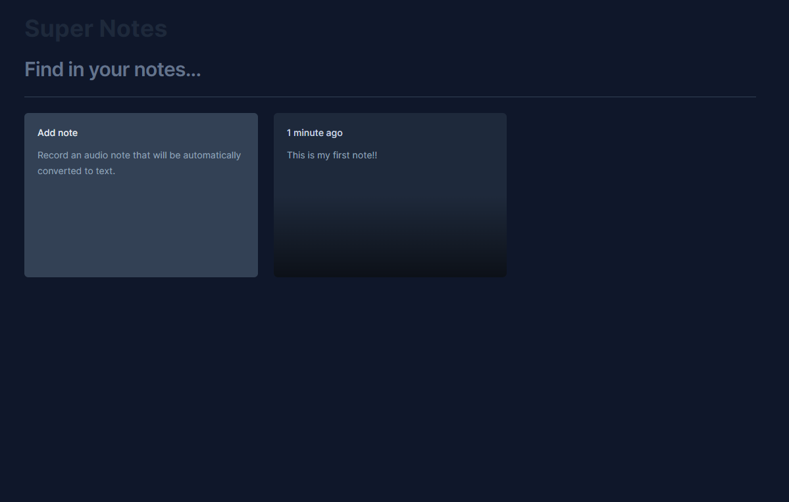

# Super Notes

## Description

Introducing Super Notes, a sleek React-based project designed for seamless note-taking. Whether you prefer typing or utilizing speech recognition, Super Notes accommodates your preferred input method. Its clean and minimalist interface ensures an uncluttered workspace, allowing you to focus on capturing your thoughts efficiently. Plus, take advantage of speech recognition functionality, available exclusively in the Chrome browser, for added convenience in transcribing your ideas effortlessly



## Technologies

1. React
2. Speech recognition

## Installation

Clone repository

```
https://github.com/ivangeier/react-notes.git
```

Instal all dependecies

```
npm install
```

Run project

```
npm run dev
```

## TODOS

Here some features and improviments that I want to add in this project:

1. Add datave to store notes
2. User login system

## Contribution:

Contributions to Super Notes are welcome! Feel free to fork the repository, make improvements, and submit pull requests to enhance the functionality or fix any issues.

## License:

This project is licensed under the MIT License - see the LICENSE file for details.

## Contact:

For any inquiries or support, please contact vilajr.ivan@gmail.com.
